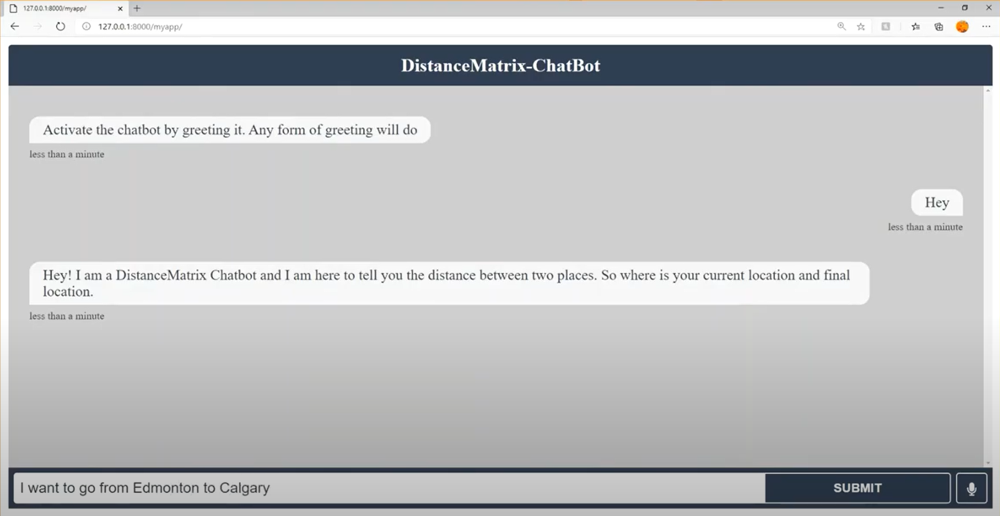
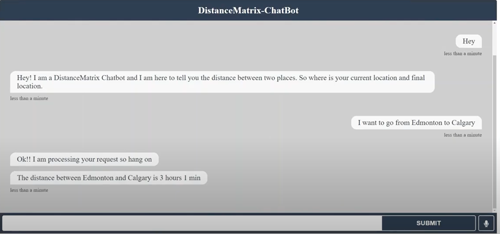

# DistanceMatrix Bot
The thought process behind this project is to create an automated chatbox which intakes user input in the form of a greeting and more specifically regarding the distance between two geographical locations and return a response with that computation in the form of vehicle travel time in such a way that the bot sounds reasonably human. 

# Prerequsites
Anaconda: for step-by-step installation guide visit https://docs.anaconda.com/anaconda/install/ 
upon installation run the command conda create -n (base environment name) python= 3.x where x is either = 6 or 7
e.g conda create -n project python=3.6
here the base environment's name is project and we're using python3.6 has the default python in this environment

inside anaconda environment be sure to install rasa using command:
pip install rasa
In order to run the custom action: First rasa run --enable-api then rasa run actions

# Running Distance Matrix Bot

Be sure to cd into the my_project folder before running the command to set up the local server:
python .\manage.py runserver
Then integrate the django server with the rasa server with this command rasa run -m models --enable-api --cors "*" --debug
click the link that appears in the terminal it should appear like http://127.0.0.1:800/
a pop up screen should appear and be sure to add /myapp to the end of the link to interact with the matrix bot! Be sure to say hello and ask the bot to compute the distance between any two cities, towns etc...

 # Sample Shots
  
  
  
  
  
